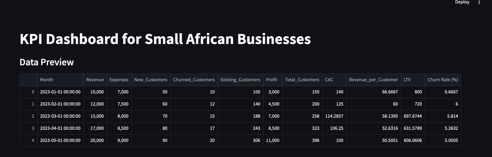
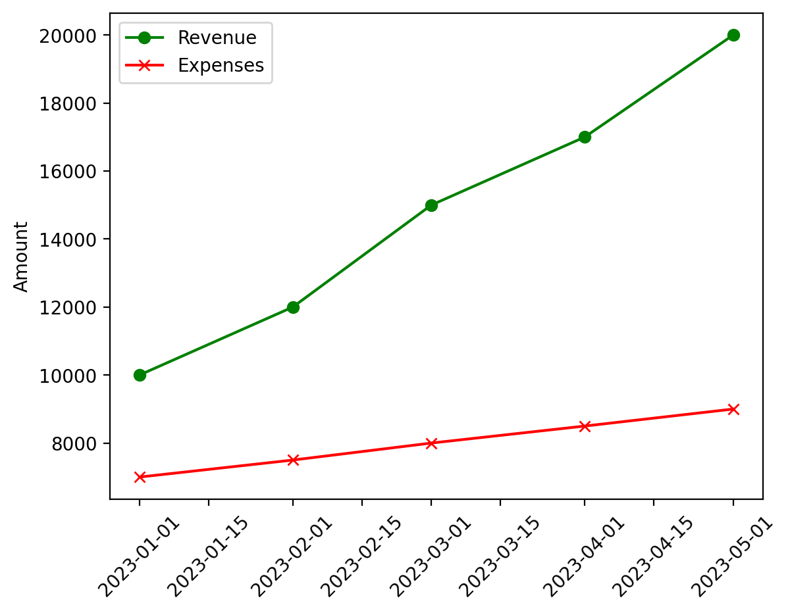
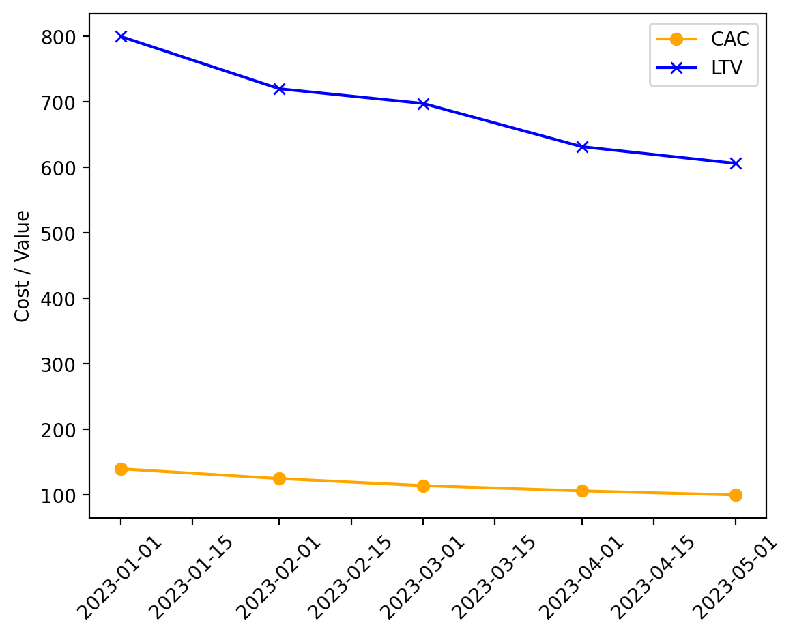
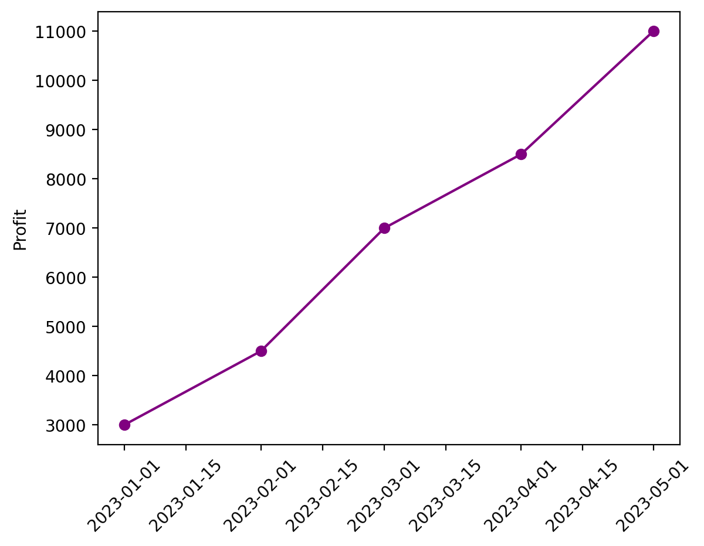
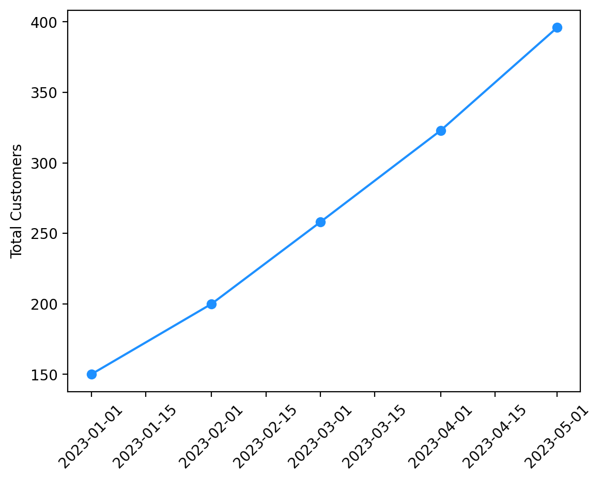
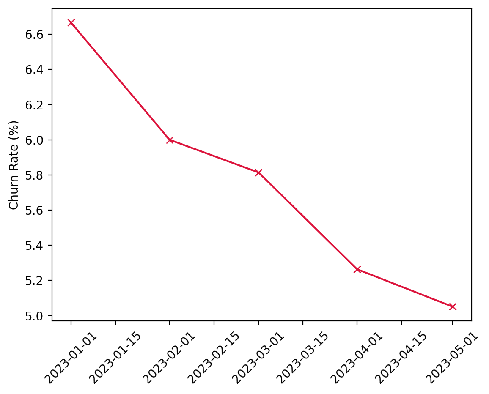

# KPI Dashboard for African Small Businesses


## Live App
[Try the Dashboard](https://kayodepanda-kpi-dashboard-africa-smb-dashboardapp-87v1wz.streamlit.app/)

---

## Overview

This lightweight, browser-based dashboard is specifically designed to empower small African businesses by enabling them to efficiently monitor and analyze their key performance indicators (KPIs) without the need for complex analytics tools. Utilizing an intuitive and user-friendly Streamlit interface, it simplifies the process of tracking vital financial and customer metrics, making data-driven decision-making accessible even for users with limited technical backgrounds. Key metrics include profit margins, customer acquisition cost (CAC), customer lifetime value (LTV), churn rates, and revenue per customer, all essential for assessing business health and growth potential.

Although the dataset incorporated is simulated for demonstration purposes, the underlying logic and structural design mirror real-world SME financial operations, providing users with a practical and relevant experience. The tool’s modular architecture ensures it is both scalable and adaptable, allowing customization to suit different regions or business models.

---

## Key Features

- Upload and manage structured CSV files containing financial and customer data
- Automated calculation of KPIs for quick insights
- Interactive visualizations including charts and dynamic metrics
- Tailored for non-technical users to facilitate ease of use
- Modular and extensible codebase for future enhancements
- Entirely browser-based, eliminating the need for local software installations

---

## Who it's For

- Entrepreneurs and small business owners across Africa looking for accessible analytics solutions
- Data analysts developing minimal viable product (MVP) dashboards
- Educators teaching concepts of KPIs, data analysis, or dashboard development
- Anyone interested in no-code tools for financial decision support and strategic planning

---

### Dashboard Preview

[](images/dashboard_preview.png)


## Sample KPI Output

| Month     | Revenue | Expenses | Profit | Total Customers | CAC     | Revenue/Customer | LTV     | Churn Rate (%) |
|-----------|---------|----------|--------|------------------|---------|------------------|---------|----------------|
| Jan 2023  | 10,000  | 7,000    | 3,000  | 150              | 140.00  | 66.67            | 800.00  | 6.67           |
| Feb 2023  | 12,000  | 7,500    | 4,500  | 200              | 125.00  | 60.00            | 720.00  | 6.00           |
| Mar 2023  | 15,000  | 8,000    | 7,000  | 258              | 114.29  | 58.14            | 697.67  | 5.81           |
| Apr 2023  | 17,000  | 8,500    | 8,500  | 323              | 106.25  | 52.63            | 631.58  | 5.26           |
| May 2023  | 20,000  | 9,000    | 11,000 | 396              | 100.00  | 50.51            | 606.06  | 5.01           |

---

##  Visual Output

The dashboard includes several visualizations to give users a quick overview of performance trends.
Here are some of the visual insights generated from this project:

###  Revenue vs Expenses Over Time  

Displays monthly revenue and expenses side-by-side to highlight profitability trends.
[](images/revenue_expenses_chart.png)

### CAC vs LTV  

Visualizes the relationship between Customer Acquisition Cost and Lifetime Value to assess customer profitability.
[](images/cac_ltv_chart.png)

## Profit Trend

Shows the progression of net profit over the selected time period.
[](images/profit_trend_chart.png)

## Customer Growth Over Time

Tracks the number of total customers each month, reflecting business expansion.
[](images/customer_growth_chart.png)

## Customer Churn Rate

Represents the monthly churn rate percentage, helping identify customer retention trends.
[](images/customer_churn_rate.png)

---

##  Tools Used

- Python
- Pandas
- Jupyter Notebook
- Matplotlib
- Streamlit
- Git & GitHub

---

## Folder Structure
```
kpi-dashboard-africa-smb/
├── dashboard/               # Streamlit app (main script: app.py)
├── data/                    # Sample financial dataset (CSV)
├── notebooks/               # Jupyter notebooks for KPI logic and testing
├── scripts/                 # Optional helper scripts (modular codebase)
├── images/                  # Dashboard screenshots
│   ├── dashboard_preview.png
│   ├── revenue_expenses_chart.png
│   ├── cac_ltv_chart.png
│   ├── profit_trend_chart.png
│   ├── customer_growth_chart.png
│   └── customer_churn_rate.png
├── requirements.txt         # Python dependencies
└── README.md                # Project documentation
```
---


## How to Run the App

Make sure you have Python and streamlit installed (version 3.8 or above is recommended).
Clone the repository:

```bash
git clone https://github.com/KayodePanda/kpi-dashboard-africa-smb.git
cd kpi-dashboard-africa-smb

#Install the required packages 
pip install -r requirements.txt

#Run the streamlit app 
streamlit run dashboard/app.py


- Interactive Streamlit web app
```

---

## Future Improvements
- Currency selector for different African markets
- Exportable reports (PDF or Excel)
- Integration with live data sources (e.g. Google Sheets)
- Optional user accounts for private use

---

## About Me

I’m Kayode Olorunmaiye, and I have a background in economics and data science. My passion lies in creating data tools that address real-world challenges for a wide range of clients, from small businesses and startups to larger organizations. I aim to deliver flexible analytics solutions that can adapt to various needs, ensuring that no one feels constrained by limited resources.
This project represents my mission to bridge that gap. It offers a simple, adaptable KPI dashboard that evolves alongside users’ needs, helping them turn raw data into meaningful insights.

---

## License

This project is licensed under the MIT License — feel free to use, modify, or build on it with credit.

<!--
Keywords: KPI Dashboard, Streamlit Dashboard, SME Analytics Africa, Customer Acquisition Cost, LTV Calculator, Churn Analysis, Business Data Visualization, Python Financial Tool, Small Business Dashboard, Streamlit Portfolio Project
-->

